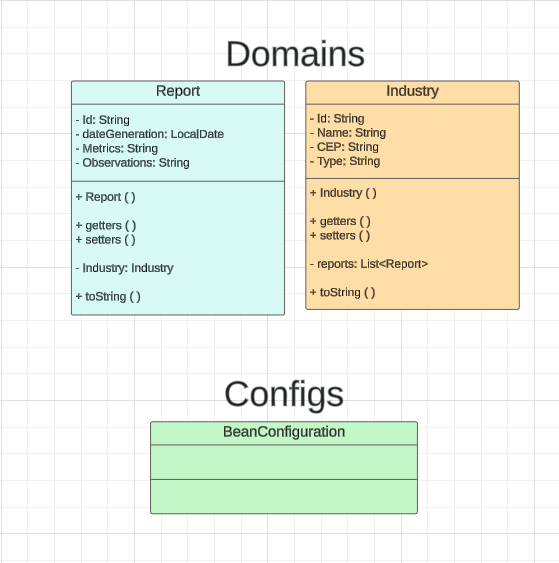

# *GlobalSolution*

## Sumário
- [Objetivo do Projeto](#Plataforma de Monitoramento e Gestão de Indústrias)
- [Análise Preditiva](#análise-preditiva)
- [Comunicação Personalizada](#comunicação-personalizada)
- [Recomendações Personalizadas](#recomendações-personalizadas)

## Plataforma de Monitoramento e Gestão de Indústrias
A proposta é desenvolver uma plataforma digital que centralize as informações de monitaoramento e gestão de energia renovável, integrando dados de consumo energético, desempenho de sistemas de geração renovável, condições climáticas e respostas a questionários sobre eficiência energética. Essa plataforma funcionaria como um verdadeiro "assistente pessoal" para a gestão energética, oferecendo:

### Análise Preditiva
Por meio de algoritmos de machine learning, a plataforma identificaria padrões de consumo e desempenho que indicam:
- Possíveis desperdícios de energia.
- Falhas nos sistemas de geração renovável.
- Oportunidades de otimização para aumentar a eficiência energética e reduzir custos operacionais.

### Comunicação Personalizada
A plataforma permite uma comunicação mais direta e eficiente com gestores e equipes, oferecendo:
- Notificações sobre desempenho energético.
- Lembretes para manutenção preventiva de equipamentos.
- Relatórios detalhados sobre consumo e eficiência.

### Recomendações Personalizadas
Com base na análise dos dados, a plataforma sugere estratégias para otimizar o uso de energia renovável, como:
- Ajustes específicos no consumo de energia.
- Planejamento e execução de manutenção preventiva.
- Priorização de fontes renováveis de acordo com as condições climáticas.

## Diagrama de Classes

## Integrantes (Todos da 2TDSPS)
### Thiago Carrillo RM553565
### Igor Oviedo RM553434
### Cauã Loureiro RM553093

